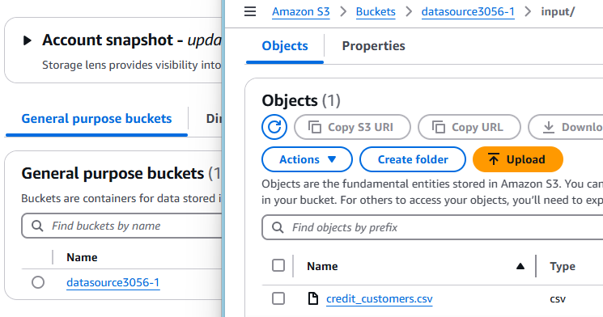

# etl-awsglue-redshift : Loading data from S3 bucket to Redshift using AWS Glue

Step 1 : Upload File to S3 Bucket

Step 2 : Create table to read input schema in Glue Data Catalog 

Step 3 : Create Redshift Cluster

Step 4 : Create ETL Pipeline to flow data from S3 to Redshift via Glue

