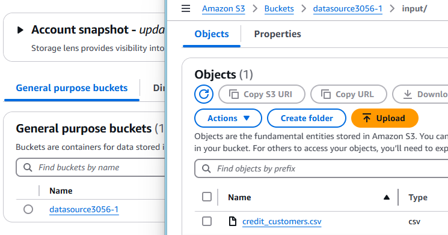

# etl-glue-s3 : Perform ETL using AWS S3 and AWS Glue 

Step 1 : Upload File to S3 Bucket

Step 2 : Create table to read input schema in Glue Data Catalog 

Step 3 : 

Step 4 : Create ETL Pipeline to flow data from S3 to Redshift via Glue

