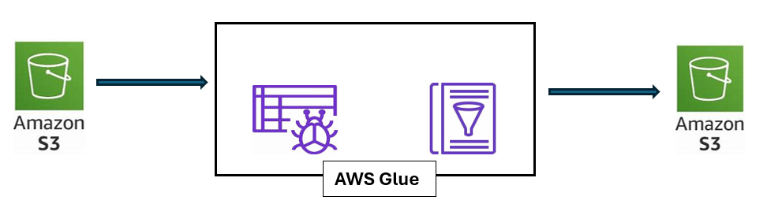

# etl-glue-s3 : Perform ETL using AWS S3 and AWS Glue 

## Architecture 

Objective : Upload CSV file to S3 Bucket. Perform Extract, Transform and Load Operations using AWS Glue on the extracted file and store the results in a new folder in the S3 bucket created previously. 

Step 1 : S3 Bucket - Upload CSV file to S3 Bucket
Create a new S3 bucket named "datasource3056-1" . Create a folder "input" and upload credit_customers.csv file which was downloaded from Kaggle.
This file has information about the customers to determine if they are eligible to be given credit.

Step 2 : AWS Glue - Create a database and a table to read input schema in Glue Data Catalog 
Create a database name gluedb
Create a crawler named "glue-crawler" which will scan the input file in S3 and create a table storing schema information
Run crawler

Step 3 : AWS Glue - Create ETL job
Select Data source as Amazon S3 and provide path to the file "credit_customers.csv"
Perform Data Cleansing and Transformation : Drop fields task will drop the unnecessary columns from the source file and Change schema will rename the column names and update data types

Select Amazon S3 as target and provide new path folder "output" where the results will be stored

Output: 

